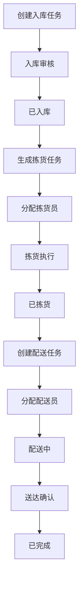

## 1. 产品概述

仓储物流配送管理系统是一套面向中小型物流仓储企业的全栈 Web 应用，覆盖从商品入库、拣货分配、配送到状态实时追踪的完整业务流程。系统旨在替代传统纸质/Excel管理方式，提升仓储运营效率，降低人为差错率，实现物流全链路数字化管理。

- 目标用户：仓储管理员、拣货员、配送员、物流调度员
- 核心价值：全流程可视化管理、任务高效分配与追踪、实时状态更新与通知

## 2. 核心功能

### 2.1 用户角色

| 角色 | 权限描述 |
|------|----------|
| 管理员 | 全模块读写权限，可审核入库任务、分配拣货/配送任务、查看所有数据 |
| 仓库操作员 | 可创建/编辑入库任务、执行拣货任务、更新任务状态 |
| 配送员 | 可查看分配给自己的配送任务、更新配送状态 |

### 2.2 功能模块

1. **仪表盘首页**：数据概览卡片、近期任务列表、状态分布图表、快捷操作入口
2. **入库管理**：入库任务列表、创建入库任务、入库审核确认、批量导入
3. **拣货管理**：拣货任务列表、自动生成拣货任务、任务分配、路径优化建议
4. **配送管理**：配送任务列表、创建配送任务、配送员分配、批量打印配送单
5. **状态追踪**：全局任务追踪看板、状态变更历史、关键节点通知
6. **任务管理**：列表视图+看板视图切换、多条件筛选、关键词搜索、任务详情

### 2.3 页面详情

| 页面名称 | 模块名称 | 功能描述 |
|----------|----------|----------|
| 仪表盘 | 统计卡片 | 展示入库/拣货/配送/完成任务数量，显示同比趋势 |
| 仪表盘 | 近期任务 | 显示最近创建和更新的任务，支持快速跳转 |
| 仪表盘 | 状态分布图 | 饼图/柱状图展示各状态任务占比 |
| 入库管理 | 任务列表 | 表格展示所有入库任务，支持筛选、搜索、分页 |
| 入库管理 | 创建入库任务 | 表单填写商品信息、数量、批次、存储位置 |
| 入库管理 | 入库审核 | 审核确认入库任务，更新状态为已入库 |
| 拣货管理 | 任务列表 | 表格展示所有拣货任务，显示优先级和区域 |
| 拣货管理 | 生成拣货任务 | 根据订单自动生成拣货任务，支持手动调整 |
| 拣货管理 | 任务分配 | 按区域/优先级分配拣货任务给操作员 |
| 拣货管理 | 路径优化 | 展示拣货路径优化建议，标注商品位置 |
| 配送管理 | 任务列表 | 表格展示所有配送任务，显示配送员和路线 |
| 配送管理 | 创建配送任务 | 填写配送信息，分配配送员 |
| 配送管理 | 批量打印 | 选择多个配送单批量打印 |
| 状态追踪 | 追踪看板 | 看板视图展示所有任务状态流转 |
| 状态追踪 | 变更历史 | 时间线展示单个任务的状态变更记录 |
| 状态追踪 | 通知中心 | 展示关键节点通知消息 |
| 任务管理 | 列表视图 | 统一任务列表，支持多条件组合筛选 |
| 任务管理 | 看板视图 | 按状态分列展示任务卡片，支持拖拽 |
| 任务管理 | 任务详情 | 展示完整任务信息和状态变更历史 |

## 3. 核心流程

### 3.1 入库流程
管理员创建入库任务 → 填写商品/数量/批次/位置 → 仓库操作员执行入库 → 审核确认 → 状态更新为已入库

### 3.2 拣货流程
系统根据订单自动生成拣货任务 → 按区域/优先级分配 → 操作员执行拣货 → 路径优化引导 → 状态更新为已拣货

### 3.3 配送流程
创建配送任务 → 分配配送员和路线 → 配送员取货出发 → 途中更新状态 → 送达确认 → 状态更新为已完成

## 4. 用户界面设计

### 4.1 设计风格

- **主色调**：深蓝灰（#1e293b）作为侧边栏和导航色，橙色（#f97316）作为强调/操作色
- **辅助色**：浅灰背景（#f8fafc），白色卡片，绿色/红色用于状态指示
- **按钮风格**：圆角（8px），主要操作用橙色实心，次要操作用灰色描边
- **字体**：标题使用思源黑体/Noto Sans SC，正文使用系统字体栈
- **布局风格**：左侧固定侧边栏导航 + 右侧内容区，卡片式内容组织
- **图标**：使用 Lucide 图标库，线条风格，2px 描边

### 4.2 页面设计概览

| 页面名称 | 模块名称 | UI要素 |
|----------|----------|--------|
| 仪表盘 | 统计卡片 | 4列网格布局，图标+数字+趋势箭头，白色卡片+轻微阴影 |
| 仪表盘 | 状态分布图 | 柱状图，浅色背景，橙色高亮 |
| 入库管理 | 任务列表 | 表格+筛选栏，行悬停高亮，状态徽章彩色标签 |
| 拣货管理 | 看板视图 | 多列看板，卡片拖拽，优先级色标（红/黄/绿） |
| 配送管理 | 配送单 | 打印友好布局，黑白为主，简洁排版 |
| 状态追踪 | 时间线 | 垂直时间线，圆形节点+连接线，状态图标 |
| 任务管理 | 双视图 | 切换按钮列表/看板，统一筛选侧边栏 |

### 4.3 响应式设计

- 桌面优先设计，断点：sm(640px)、md(768px)、lg(1024px)、xl(1280px)
- 移动端侧边栏折叠为汉堡菜单
- 表格在移动端转为卡片列表
- 看板视图在移动端垂直堆叠
- 触摸优化：按钮最小点击区域 44x44px

### 4.4 动画与交互

- 页面切换：淡入过渡（200ms）
- 卡片悬停：轻微上移+阴影加深
- 状态变更：颜色渐变过渡
- 通知：右上角滑入，3秒后自动消失
- 加载状态：骨架屏动画
