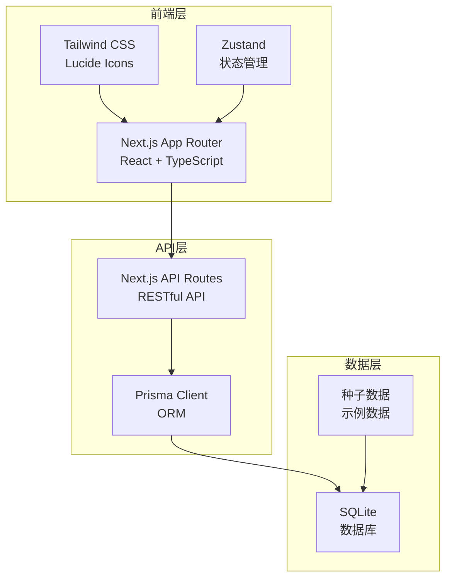
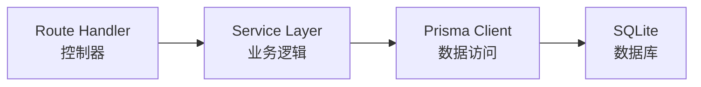
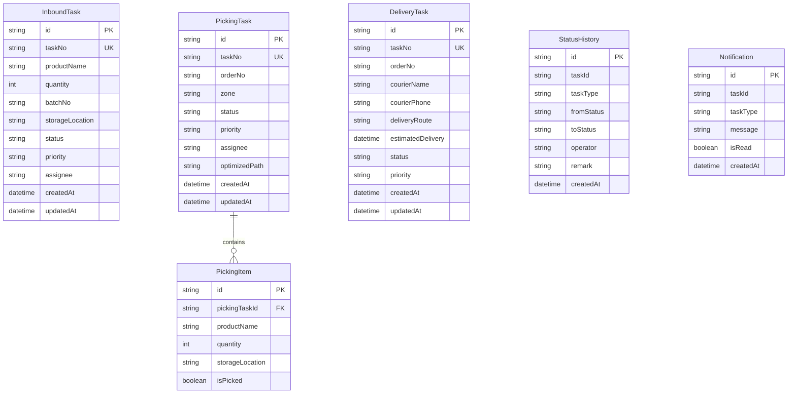

## 1. 架构设计



## 2. 技术说明

- **前端**：Next.js 14 App Router + React 18 + TypeScript + Tailwind CSS
- **初始化工具**：create-next-app
- **后端**：Next.js API Routes (Route Handlers)
- **数据库**：SQLite + Prisma ORM
- **状态管理**：Zustand
- **图标**：lucide-react
- **图表**：recharts
- **表单验证**：zod

## 3. 路由定义

| 路由 | 用途 |
|------|------|
| `/` | 仪表盘首页，展示数据概览 |
| `/inbound` | 入库管理，入库任务列表 |
| `/inbound/create` | 创建入库任务 |
| `/inbound/[id]` | 入库任务详情 |
| `/picking` | 拣货管理，拣货任务列表 |
| `/picking/[id]` | 拣货任务详情 |
| `/delivery` | 配送管理，配送任务列表 |
| `/delivery/create` | 创建配送任务 |
| `/delivery/[id]` | 配送任务详情 |
| `/tracking` | 状态追踪看板 |
| `/tasks` | 统一任务管理（列表+看板视图） |
| `/tasks/[id]` | 任务详情 |

## 4. API 定义

### 4.1 入库管理 API

```
GET    /api/inbound          - 获取入库任务列表（支持分页、筛选）
POST   /api/inbound          - 创建入库任务
GET    /api/inbound/:id      - 获取入库任务详情
PUT    /api/inbound/:id      - 更新入库任务
PATCH  /api/inbound/:id/status - 更新入库任务状态
```

### 4.2 拣货管理 API

```
GET    /api/picking          - 获取拣货任务列表
POST   /api/picking          - 创建拣货任务
POST   /api/picking/generate - 根据订单自动生成拣货任务
GET    /api/picking/:id      - 获取拣货任务详情
PUT    /api/picking/:id      - 更新拣货任务
PATCH  /api/picking/:id/assign - 分配拣货任务
PATCH  /api/picking/:id/status - 更新拣货任务状态
```

### 4.3 配送管理 API

```
GET    /api/delivery         - 获取配送任务列表
POST   /api/delivery         - 创建配送任务
GET    /api/delivery/:id     - 获取配送任务详情
PUT    /api/delivery/:id     - 更新配送任务
PATCH  /api/delivery/:id/assign - 分配配送任务
PATCH  /api/delivery/:id/status - 更新配送任务状态
```

### 4.4 状态追踪 API

```
GET    /api/tracking         - 获取全局任务追踪数据
GET    /api/tracking/:id/history - 获取任务状态变更历史
GET    /api/notifications    - 获取通知列表
```

### 4.5 通用 API

```
GET    /api/stats            - 获取仪表盘统计数据
GET    /api/tasks            - 获取统一任务列表（支持筛选、搜索）
```

### 4.6 TypeScript 类型定义

```typescript
type TaskType = 'INBOUND' | 'PICKING' | 'DELIVERY'
type TaskStatus = 'PENDING' | 'IN_PROGRESS' | 'COMPLETED' | 'CANCELLED'
type Priority = 'LOW' | 'MEDIUM' | 'HIGH' | 'URGENT'

interface InboundTask {
  id: string
  taskNo: string
  productName: string
  quantity: number
  batchNo: string
  storageLocation: string
  status: TaskStatus
  priority: Priority
  assignee: string | null
  createdAt: string
  updatedAt: string
}

interface PickingTask {
  id: string
  taskNo: string
  orderNo: string
  items: PickingItem[]
  zone: string
  status: TaskStatus
  priority: Priority
  assignee: string | null
  optimizedPath: string[] | null
  createdAt: string
  updatedAt: string
}

interface DeliveryTask {
  id: string
  taskNo: string
  orderNo: string
  courierName: string | null
  courierPhone: string | null
  deliveryRoute: string
  estimatedDelivery: string | null
  status: TaskStatus
  priority: Priority
  createdAt: string
  updatedAt: string
}

interface StatusHistory {
  id: string
  taskId: string
  taskType: TaskType
  fromStatus: TaskStatus
  toStatus: TaskStatus
  operator: string
  remark: string | null
  createdAt: string
}

interface Notification {
  id: string
  taskId: string
  taskType: TaskType
  message: string
  isRead: boolean
  createdAt: string
}
```

## 5. 服务端架构图



## 6. 数据模型

### 6.1 数据模型定义



### 6.2 数据定义语言

```sql
CREATE TABLE InboundTask (
  id TEXT PRIMARY KEY,
  taskNo TEXT UNIQUE NOT NULL,
  productName TEXT NOT NULL,
  quantity INTEGER NOT NULL,
  batchNo TEXT NOT NULL,
  storageLocation TEXT NOT NULL,
  status TEXT NOT NULL DEFAULT 'PENDING',
  priority TEXT NOT NULL DEFAULT 'MEDIUM',
  assignee TEXT,
  createdAt DATETIME NOT NULL DEFAULT CURRENT_TIMESTAMP,
  updatedAt DATETIME NOT NULL DEFAULT CURRENT_TIMESTAMP
);

CREATE TABLE PickingTask (
  id TEXT PRIMARY KEY,
  taskNo TEXT UNIQUE NOT NULL,
  orderNo TEXT NOT NULL,
  zone TEXT NOT NULL,
  status TEXT NOT NULL DEFAULT 'PENDING',
  priority TEXT NOT NULL DEFAULT 'MEDIUM',
  assignee TEXT,
  optimizedPath TEXT,
  createdAt DATETIME NOT NULL DEFAULT CURRENT_TIMESTAMP,
  updatedAt DATETIME NOT NULL DEFAULT CURRENT_TIMESTAMP
);

CREATE TABLE PickingItem (
  id TEXT PRIMARY KEY,
  pickingTaskId TEXT NOT NULL REFERENCES PickingTask(id),
  productName TEXT NOT NULL,
  quantity INTEGER NOT NULL,
  storageLocation TEXT NOT NULL,
  isPicked BOOLEAN NOT NULL DEFAULT 0
);

CREATE TABLE DeliveryTask (
  id TEXT PRIMARY KEY,
  taskNo TEXT UNIQUE NOT NULL,
  orderNo TEXT NOT NULL,
  courierName TEXT,
  courierPhone TEXT,
  deliveryRoute TEXT NOT NULL,
  estimatedDelivery DATETIME,
  status TEXT NOT NULL DEFAULT 'PENDING',
  priority TEXT NOT NULL DEFAULT 'MEDIUM',
  createdAt DATETIME NOT NULL DEFAULT CURRENT_TIMESTAMP,
  updatedAt DATETIME NOT NULL DEFAULT CURRENT_TIMESTAMP
);

CREATE TABLE StatusHistory (
  id TEXT PRIMARY KEY,
  taskId TEXT NOT NULL,
  taskType TEXT NOT NULL,
  fromStatus TEXT NOT NULL,
  toStatus TEXT NOT NULL,
  operator TEXT NOT NULL,
  remark TEXT,
  createdAt DATETIME NOT NULL DEFAULT CURRENT_TIMESTAMP
);

CREATE TABLE Notification (
  id TEXT PRIMARY KEY,
  taskId TEXT NOT NULL,
  taskType TEXT NOT NULL,
  message TEXT NOT NULL,
  isRead BOOLEAN NOT NULL DEFAULT 0,
  createdAt DATETIME NOT NULL DEFAULT CURRENT_TIMESTAMP
);

CREATE INDEX idx_inbound_status ON InboundTask(status);
CREATE INDEX idx_picking_status ON PickingTask(status);
CREATE INDEX idx_delivery_status ON DeliveryTask(status);
CREATE INDEX idx_status_history_task ON StatusHistory(taskId, taskType);
CREATE INDEX idx_notification_read ON Notification(isRead);
```
